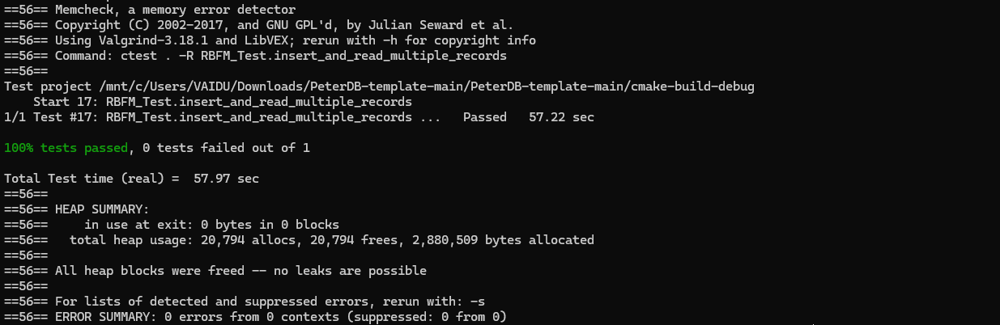

## Debugger and Valgrind Report

### 1. Basic information
 - Team #:
 - Github Repo Link:
 - Student 1 UCI NetID:
 - Student 1 Name:
 - Student 2 UCI NetID (if applicable):
 - Student 2 Name (if applicable):


### 2. Using a Debugger

1. **Setting Breakpoints**  
   - Breakpoints were set at critical points in the code, such as at the start of the `initializeHiddenPage` function and after significant operations (e.g., memory allocation and file writing).  
   - **Command used in gdb:**  
     ```bash
     (gdb) break FileHandle::initializeHiddenPage
     ```  
   - This allowed us to pause execution and examine the state of variables and memory.

2. **Step Over and Step Into**  
   - **Step Over:** Used to execute the current line of code while skipping over function calls, focusing on the main flow of execution.  
   - **Step Into:** Used to dive into functions like `memcpy` to verify that data packing worked as expected.  
   - **Commands used in gdb:**  
     ```bash
     (gdb) step
     (gdb) next
     ```

3. **Evaluating Expressions**  
   - Variable values such as `totalPageCount`, `readCounter`, and `dataOffset` were evaluated during execution to ensure correctness.  
   - **Command used in gdb:**  
     ```bash
     (gdb) print totalPageCount
     ```

### 3. Using Valgrind

To detect memory leaks and other memory-related issues in my code, I run the following command in my project directory:

valgrind ctest . -R RBFM_Test.insert_and_read_multiple_records

This command runs the test for inserting and reading multiple records while Valgrind checks for memory-related issues. The ctest command is used to execute the test with the -R flag to specify the name of the test (in this case, RBFM_Test.insert_and_read_multiple_records).



Similarly, valgrind was used with all the tests for checking possible memory leaks.